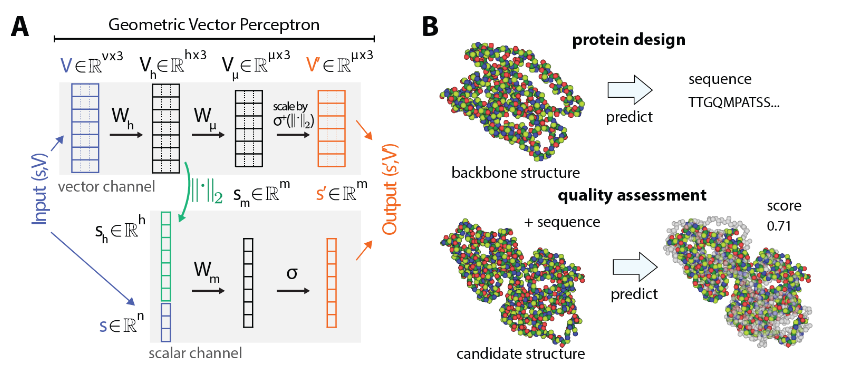
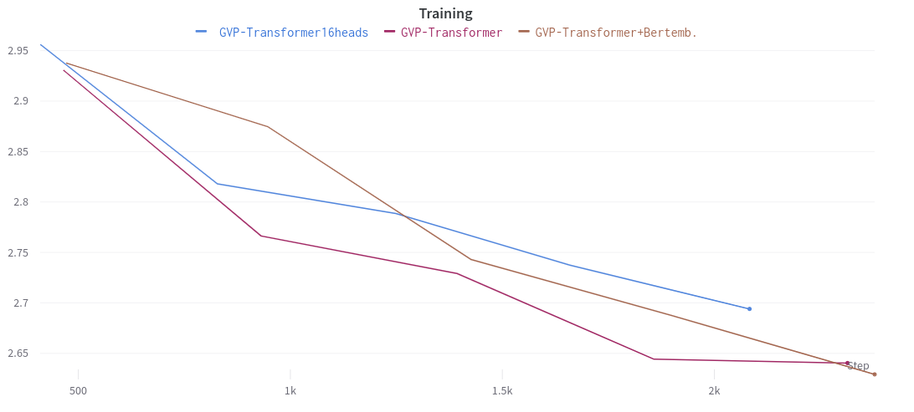
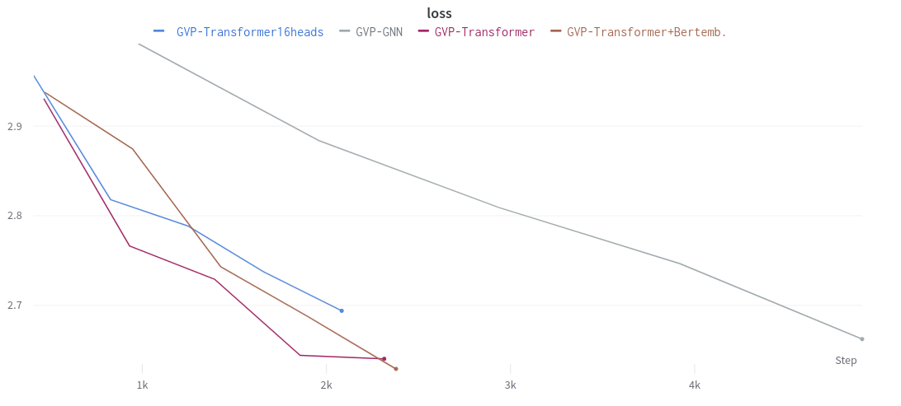
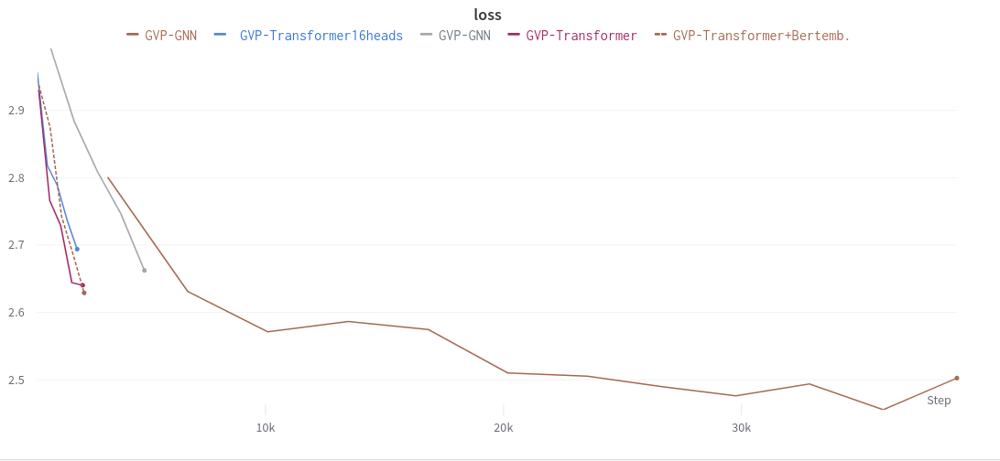
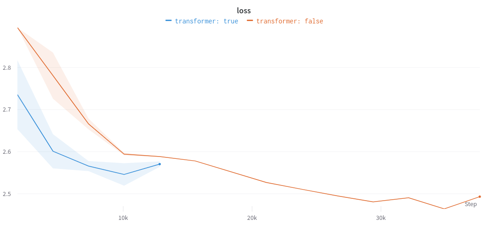

# GVP-GNN with transformer on ATOM3d tasks


## Introduction
In recent years, the field of machine learning has been increasingly applied to the analysis and understanding of 3D structures of large biomolecules. This emerging area holds great promise for advancing our knowledge in fields such as biochemistry, structural biology, and drug discovery (such as finding a COVID vaccin). Despite the growing interest, there is still a lack of a comprehensive network architecture that effectively combines the geometric and relational aspects inherent in this domain.

To bridge this gap, the paper titled "Learning from Protein Structure with Geometric Vector Perceptrons" by Bowen Jing, Stephan Eismann, Patricia Suriana, Raphael J.L. Townshend, and Ron O. Dror (2021) from Stanford University introduces a novel approach that addresses the limitations of existing architectures. The authors propose the use of geometric vector perceptrons (GVP's), which extend the functionality of standard dense layers to operate on collections of Euclidean vectors. By integrating these layers into graph neural networks (GNNs), the proposed approach enables simultaneous geometric and relational reasoning on efficient representations of macromolecule. Jing et al. (2021) call their model, which integrates GVPs into GNNs, the GVP-GNN.

The main objective of this study is to demonstrate the effectiveness of GVP-GNNs in tackling two fundamental challenges in learning from protein structure: model quality assessment (MQA) and computational protein design (CPD). Through comprehensive experiments and evaluations, the authors compare their approach with existing classes of architectures, including state-of-the-art convolutional neural networks and graph neural networks. The results showcase their state-of-the-art performance of their proposed method in both problem domains, highlighting its potential to advance the field of learning from protein structure.

In this review, we will provide an analysis of the key components of the paper, discussing its strengths, weaknesses, and potential implications. Additionally, we will present our group's response to the paper, highlighting our novel contribution and its relevance to the research presented. Finally, we will delve into the results obtained by our work, linking them to accompanying python files. By the end of this blogpost, readers will gain a comprehensive understanding of the significance of the paper's findings and our contributions to the field.

Before proceeding further, it is essential to review related work in the area of learning from protein structure. Prior to the introduction of geometric vector perceptrons (GVPs) by Jing et al. (2021), several approaches have been explored in the field of learning from protein structure. One common approach involves the use of graph neural networks (GNNs), which excel in relational reasoning. These networks operate on the relational structure of proteins, considering the amino acid sequence and residue interactions that contribute to the overall properties of the molecule (Battaglia et al., 2018). Conversely, convolutional neural networks (CNNs) focus on the geometric aspects of the structure, directly analyzing the arrangement and orientation of atoms in 3D space, which has been used 
for the task protein model quality assessment by the authors (Pagès et al., 2019).

While both GNNs and CNNs have shown promises, they individually lack a comprehensive integration of both geometric and relational reasoning. This limitation motivates the introduction of GVP-GNNs as a unifying architecture that combines the strengths of these two families of methods.
The paper "ATOM3D: Tasks On Molecules in Three Dimensions" by Townshend et al. (2020) serves as a baseline in the field of learning from protein structure. This paper presents a comprehensive framework for benchmarking machine learning models on various tasks related to 3D molecular structures. It provides a standardized dataset and evaluation protocols for tasks such as protein structure prediction, ligand binding, and protein-protein interaction. The authors employ several models to tackle different tasks related to 3D molecular structures. These models include 3D convolutional neural networks (3DCNNs), graph neural networks (GNNs), and equivariant neural networks (ENN).


### Geometric vector perceptrons (GVP) explained
The basic idea behind GVPs is to represent protein structures as sets of geometric vectors. Each vector in the set corresponds to a specific geometric feature of the protein, such as the position of an atom or the orientation of a molecular bond. These vectors capture the spatial relationships and characteristics of the protein's constituent parts.

In traditional neural networks, protein structures are typically represented using fixed-length feature vectors or matrices. This fixed-length feature vector contains less information about the protein-structure than the GVP's and therefore limits the capability of the neural network.



At its core, a Geometric Vector Perceptron (GVP) is designed to process both scalar (bottom-left in the image) and vector features (top-left in image) and compute new features based on them. The GVP consists of several key components: linear transformations, non-linearities, and concatenation.

Let's go through the steps of how a GVP works:

> Input: The GVP takes as input a tuple (s, V), where s represents scalar features and V represents vector features. The scalar features are typically represented as a vector in ℝ^n, and the vector features are represented as a matrix in ℝ^(ν×3), where ν is the number of vectors and each vector has three components (x, y, z).
>
> Linear transformations: The GVP applies separate linear transformations to the scalar and vector features. It uses two sets of weight matrices: W_m for scalar features and W_h for vector features. The linear transformations can be represented as s_h = W_m s and V_h = W_h V, where s_h represents the transformed scalar features and V_h represents the transformed vector features.
>
> Concatenation: Before further processing the scalar features, the L2 norm of the transformed vector features V_h is calculated. This allows the GVP to extract rotation-invariant information from the input vectors. The L2 norm of each vector is computed row-wise, resulting in a vector s_h+n with dimensions (h+n), where h represents the maximum value between ν and µ (the output dimensionality of the vector features).
>
> Non-linearities: After concatenation, non-linear activation functions are applied to both the transformed scalar features s_h and the transformed vector norm features s_h+n. The specific non-linearities used can vary, but commonly used activation functions include sigmoid, tanh, or ReLU.
>
> Vector nonlinearity: The transformed vector features V_h are further processed using a separate linear transformation, W_µ. This transformation is followed by an element-wise multiplication with the vector norm features s_h+n. This vector nonlinearity operation scales the vectors based on their corresponding norms, allowing control over the output dimensionality independently of the number of norms extracted.
>
> Output: Finally, the GVP outputs the computed features as (s_0, V_0), where s_0 represents the final scalar features and V_0 represents the final vector features.

The GVP architecture is designed to possess desirable properties such as equivariance and invariance. Equivariance means that the vector outputs of the GVP are transformed in the same way as the input vectors under arbitrary compositions of rotations and reflections in 3D space. Invariance means that the scalar outputs of the GVP remain unchanged under the same transformations.

By leveraging linear transformations, non-linearities, and concatenation, GVPs are able to capture geometric relationships and extract rotation-invariant information from vector features. This makes them useful for various tasks that involve analyzing and reasoning about geometric data.

## Weaknesses/Strengths/Potential
The paper "Learning from Protein Structure with Geometric Vector Perceptrons" presents an innovative approach that addresses the limitations of existing network architectures for learning from protein structure as discussed in the introduction. While the proposed method introduces significant advancements, such as capturing geometric properties in GNNs, it is important to consider its strengths, weaknesses, and potential implications.

#### Weaknesses
One of the primary weaknesses of the proposed method lies in the use of geometric vector perceptrons (GVP) as the primary building block for the network architecture. Although GVPs offer the advantage of operating on collections of Euclidean vectors, they may not fully capture the complexity and long-range dependencies present in protein structure data. This limitation could potentially hinder the model's ability to learn intricate spatial relationships within protein structures accurately.

Furthermore, the reliance on dense layers within the GVPs introduces computational inefficiencies, especially when dealing with large-scale datasets. The increased parameter count and computational complexity may pose challenges when deploying the model in real-world scenarios or when working with limited computational resources.

#### Strengths
Despite the identified weaknesses, the proposed approach also exhibits several notable strengths. The integration of geometric and relational reasoning within the network architecture allows for a comprehensive understanding of the structural aspects of macromolecules. By leveraging GVPs and graph neural networks, the model can capture both local geometric features and global relational information, providing a more holistic representation of protein structure.

Moreover, the authors demonstrate the effectivenes of their approach by showcasing significant improvements over existing architectures, including state-of-the-art convolutional neural networks and graph neural networks. This performance enhancement is particularly evident in the two fundamental challenges addressed in the paper: model quality assessment and computational protein design. The superior results obtained by the proposed method underscore its potential as a powerful tool for advancing the field of learning from protein structure.

#### Potential
The paper's proposed approach opens up several exciting possibilities for future research and applications. One potential avenue for improvement is the replacement of GVPConv with a transformerConv. Transformers have shown remarkable success in various natural language processing tasks and have the potential to capture long-range dependencies effectively. By incorporating a transformerConv module into the network architecture, it is possible to enhance the model's ability to capture global relationships and improve its performance on complex protein structure data.

Additionally, the authors' idea of replacing the linear layers within the transformerConv with GVPs introduces a novel combination of architectural components. This, approach has the potential to exploit the strengths of both GVPs and transformers, leveraging the geometric reasoning capabilities of GVPs while benefiting from the attention mechanisms and parallelizability of transformers. Further exploration and experimentation with this hybrid architecture could yield even more robust and efficient models for learning from protein structure.


### Method
#### Datasets and tasks
In order to assess the quality of our reimplementation of the GVP architecture, as well as the GVP architecture with the added transformer, we used the ATOM3D set of datasets (Townshend et al., 2020). ATOM3D is a collection of benchmark datasets for machine learning in structural biology. It concerns the three-dimensional structure of biomolecules, including proteins, small molecules, and nucleic acids and is designed as a benchmark for machine learning methods which operate on 3D molecular structure. The different datasets in ATOM3D also include specific tasks for our model to optimise and evaluate. For our research, we used the following sets of dataset and task from ATOM3D.

<ol>
<li> <details><summary>RES</summary><blockquote>
  <details><summary>The RES dataset consists of atomic environments extracted from nonredundant structures in the PDB. This dataset is accompanied by a classification task where the goal is to predict the identity of the amino acid in the center of the environment based on all other atoms in that environment.</summary>
  </details>
</blockquote></details>
</li>
<li> <details><summary>LBA</summary><blockquote>
  <details><summary>The LBA dataset is uses a curated database containing protein-ligand complexes from the PDB and their corresponding binding strengths. The task at hand is We predict pK = -log(K), where K is the binding affinity in Molar units.</summary>
  </details>
</blockquote></details>
</li>
<li> <details><summary>SMP</summary><blockquote>
  <details><summary>The SMP dataset uses the QM9 dataset (Ruddigkeit et al., 2012; Ramakrishnan et al., 2014), which contains structures and energetic, electronic, and thermodynamic properties for 134,000 stable small organic molecules, obtained from quantum-chemical calculations. The task here is to predict all molecular properties from the ground-state structure.</summary>
</blockquote><details>
</li>
<li> <details><summary>LEP</summary><blockquote>
  <details><summary>This is a novel dataset created by curating proteins from several families with both ”active” and ”inactive” state structures, and model in 527 small molecules with known activating or inactivating function using the program Glide. The corresponding task here can be formulated as a binary classification tsk where the goal is to predict whether or not a molecule bound to the structures will be an activator of the protein's function or not.</summary>
  </details>
</blockquote></details>
</li>
<li> <details><summary>MSP</summary><blockquote>
  <details><summary>This is a novel dataset which was derived by collecting single-point mutations from the SKEMPI database (Jankauskaitė et al., 2019) and model each mutation into the structure to produce mutated structures. The task here can be seen as a binary classification task where we predict whether the stability of the complex increases as a result of the mutation.</summary>
  </details>
</blockquote></details>
</li>
</ol>

#### Evaluation metric
Since the data and tasks that are described above differ, they use different evaluation metrics to assess the quality of the model. We will describe the used metrics here briefly.

**Mean Absolute Error (MAE) -** 
This metric measures errors between paired observations that are supposed to express the same phenomenon. It is calculated as the sum of absolute errors divided by the sample size, making it an average over the absolute errors. A lower MAE indicates better classification. The MAE can be calculated as follows: $$MAE= \frac{1}{n}(\sum_{i=1}^{n} |y_i - x_i|) = \frac{1}{n}(\sum_{i=1}^{n} |e_i|)$$

**Root-Mean-Square Error (RMSE) -**
RMSE is a commonly used evaluation metric in regression tasks that measures the average deviation between predicted and actual values. It calculates the square root of the average of squared differences between predicted and true values. RMSE provides a single-value representation of the overall model performance, with a lower RMSE indicating better accuracy. It is useful for assessing the magnitude of prediction errors and comparing different models or parameter settings. It is calculated as follows: $$\text{RMSE} = \sqrt{\frac{1}{n}\sum_{i=1}^{n}(y_i - \hat{y}_i)^2}$$ Here, $n$ is the number of samples, $y$ is the target variable, and $\hat{y}$ is the predicted variable.

**Area Under the Receiver Operating Characteristic Curve (AUROC) -** 
AUROC is a commonly used evaluation metric in machine learning for binary classification problems. It quantifies the performance of a classifier by measuring the trade-off between its true positive rate (sensitivity) and false positive rate (1 - specificity) across different classification thresholds. The AUROC value ranges between 0 and 1, with a higher value indicating better classifier performance, where an AUROC of 0.5 suggests a random classifier and an AUROC of 1 represents a perfect classifier.

**Area Under the Precision-Recall Curve (AUPRC)**
AUPRC, is another evaluation metric commonly used in binary classification problems. It assesses the trade-off between precision and recall across various classification thresholds. The precision-recall curve plots precision (the fraction of correctly predicted positive instances) against recall (the fraction of actual positive instances correctly predicted). A higher AUPRC indicates better classifier performance, with an AUPRC of 0 representing a random classifier and an AUPRC of 1 representing a perfect classifier. Compared to AUROC, AUPRC is especially useful when dealing with imbalanced datasets where the positive class is rare.


**Accuracy -**
Accuracy is a common evaluation metric used in classification tasks to measure the overall correctness of predictions made by a classifier. It calculates the proportion of correct predictions out of the total number of predictions. It is a simple and intuitive metric, but it may not be suitable for imbalanced datasets where the class distribution is skewed. Nonetheless, a higher accuracy score indicates better performance, with 100% accuracy representing a perfect classifier. It is calculated as follows: $$\text{Accuracy} = \frac{\text{Number of Correct Predictions}}{\text{Total Number of Predictions}}$$


#### Vector Gating
The authors of [Equivariant Graph Neural Networks for 3D Macromolecular Structure](https://arxiv.org/abs/2106.03843) show that a modified GVP layer with vector gating improves performance on most of the ATOM3D tasks. The original GVP as described in Jing et al. (2021) has been modified in the last step such that we allow information to propagate from the scalar channels to the vector channels. The vector gating modification enables the GVP to inherit the Universal Approximation Property  of dense  layers  with  respect  to rotation- and reflection-equivariant functions F:Rν×3→R3, in addition to the approximation property for invariant functions shown by Jing et al. (2021). Jing et al (2021) also retrieved better evaluation results when vector gating was enabled. We therefore made the decision to enable vector gating as well on all our model experiments. 

#### Batch size
The training process was conducted on a GPU. However, due to the larger size of the model incorporating the Transformer within the GVP, it was not feasible to use the same batch size as in previous experiments. Despite this limitation, we performed experiments with multiple seeds, mitigating the potential impact of varying batch sizes on the training process.
 

## Novel Contribution
This work uses the original Geometric Vector Perceptrons GVP (with vector gating) and combines a TransformerConv layer attenmpting to further improve the the baseline model.
Additionally, on the RES task, we test with using pretrained ProteinBERT embeddings, trained on amino acids, to increase model performance or speed up the learning process.

### The TransformerConv explained
> The TransformerConv is a component that can be used in graph neural networks (GNNs) and uses the ground breaking Transformer architecture, originally proposed for natural language processing tasks, and adapts it for graph data.
>
> The core operation of TransformerConv is the multi-head dot product attention mechanism. It calculates attention coefficients $\alpha_{ij}$ between pairs of nodes to determine the importance of information flow from one node to another. The attention coefficients are computed as follows:
> 
> $$\alpha_{ij} = {softmax((W1 * x_i)^T * (W2 * x_j) \over \\sqrt(d))} $$
>
> Here, $W1$ and $W2$ are learnable weight matrices, $x_i$ and $x_j$ are the node features of nodes $i$ and $j$, and $d$ is the dimensionality of the node features.
The attention coefficients control how much information from neighbouring nodes contributes to the updated representation of a node. Higher attention coefficients imply stronger information flow between nodes.
>
> The updated representation of node $i$, $x_i'$, is computed as follows:
>
> $$x_i' = W3 * x_i + ∑(\alpha_{ij} * W4 * x_j)$$
>
> Here, $W3$ and $W4$ are learnable weight matrices.
> 
> The TransformerConv supports multiple heads of attention, allowing it to capture diverse relationships and dependencies in the graph. The attention outputs from each head can be either concatenated or averaged, controlled by the concat parameter. Concatenation allows for increased expressiveness, while averaging reduces the dimensionality of the output.
> 
> A \beta parameter is introduced as an additional mechanism to combine aggregation and skip information. It computes a learnable weight, $\beta_i$, for each node $i$ based on its transformed node features and aggregated features from its neighbours. The updated representation of node $i$ becomes:
> 
> $$x_i' = \beta_i * W1 * x_i + (1 - \beta_i) * (∑(\alpha_{ij} * W2 * x_j))$$
> 
> Here, $\beta_i$ is computed using a sigmoid function applied to a concatenation of the transformed node features, aggregated features, and their difference.
> 
> By dropping out attention coefficients during training, it allows each node of the model to be exposed to a stochastically sampled neighbourhood. This aids in regularization and reduces overfitting.

Overall, the TransformerConv operator in the paper extends the Transformer architecture to handle graph-structured data. It leverages multi-head attention, optional edge features, and additional mechanisms like concatenation, averaging, and weighted aggregation to capture meaningful relationships and propagate information effectively through the graph. By adapting the powerful Transformer model to graph data, TransformerConv enables improved performance in various graph-based tasks, including node classification, link prediction, and graph generation.

> [`torch geometric`](https://pytorch-geometric.readthedocs.io/en/latest/generated/torch_geometric.nn.conv.TransformerConv.html?highlight=TransformerConv#torch_geometric.nn.conv.TransformerConv) 
> This TransformeConv has to match the inputs and output of the GVP. We used the base TransformeConv from our supervisor TA https://github.com/congliuUvA/gvp originally testing on sequence prediction.

#### How it is intergrated in the original GVP-GNN

- To integrate within the whole sequential GVP model consisting of different kind of layer under which the GVPConv `MessagePassing` Layer. We replaced the GVPConv layer by the TransformerConv layer described above. However, within this TransformerConv `MessagePassing` layer we alter it's linear layers with the GVP layer.

```
GVP(nn.Module):
  layer = [
            TransformerConv(), 
            ...
            ]
            
TransformerConv(MessagePassing):

  # Instead of dense layers
  gvp_key = gvp.GVP(in_dims, out_dims,
            activations=(F.relu, None), vector_gate=True)
  gvp_query, gvp_value, gvp_edge = ...

  def forward():
        ...
  def message():    
        ...
```

> __Note__: This is different than using the (Structured) Transformer architecture as the whole model which performance worse than the GVP, as was shown in the paper "Learning from Protein Structure with Geometric Vector Perceptrons".

### BERT language model 
The ATOM3D tasks share a common underlying representation and problem domain, presenting an opportunity for _transfer learning_ to improve performance on data-poor tasks. Therefore, the authors use transfer learning techniques to leverage the model weight trained on data-rich (SMP,RES) settings to improve model training on data-poor (MSP, LEP) dataset. 

We incorperate two levels of intergrating a BERT protein language model into the model, in order to boost the performance on the Residue Identity (RES) dataset.
Amino acid substitution prediction is crucial for protein engineering. We use a new dataset extracted from PDB structures to classify amino acid identities based on surrounding structural environments, divided by protein topology classes. 
The first level consists of using the BERT amino acid embedding `<nn.Embedding>`   
to boost the training process instead of random initilizing. By using pre-trained embeddings from the paper [ProtTrans: Toward Understanding the Language of Life Through Self-Supervised Learning](https://github.com/agemagician/ProtTrans) the model already has relation information about how similair certran amino acids in their structure and behavior. We _unfroze_ the weight such that they are still trainable.

The second level uses the masked language model function to predict the _[MASK]_ representing the amino acid we search for the RES data task. We combine the prediction of the GVP-GNN + TransformerConv with the BERT prediction to ultimately end up with one amino acid. We combined both [batchsize,20] (for the 20 different amino acids) for the GVP and BERT prediction using a MLP, inspired by the paper [Sequence and structure based deep learning models represent different aspects of protein biochemistry](https://www.biorxiv.org/content/10.1101/2023.03.20.533508v1) 

## Results
Every task has been trained on three seeds (0,34,42) on 50 epochs with same parameters as the original GVP-GNN.   
Below are the best performing model checkpoint performance on the evaluation dataset.
| **Task** | **Metric** | **GVPGNN**       | **GVP-GNN + TransformerConv** |
|----------|------------|------------------|--------------------|
| **SMP**  | MAE        | **18.64 ± 0.20** | 18.77 ± 	0.19       |
| **LBA**  | RMSE       | 1.64 ± 0.07      | **1.58 ± 0.03**    |
| **LEP**  | AUROC      | 0.53 ± 0.06      | **0.61 ± 0.04**    |
|          | AUPRC      |  0.41 ±  0.03 |   **0.47 ± 0.03**|
| **MSP**  | AUROC      | **0.69 ±	0.03**   | 0.67	± 0.01         |
|          | AUPRC      | **0.25±0,03**    | 0,24±0,03          |


### Residue Identity (RES) dataset
#### What is the influence of the number of transformer head?



#### How does the original GVP compare with the _Transformer_ implementation?


<!-- 
 -->

> Can we conclude that TransformerConv gives the learning process a head start? We still see for both that the loss is decreasing so to be sure 
> we need to train for longer. Below we combined group multiple run based on wether the Transformer was used or not, for a longer training periode. 


<!--  -->


<ul>
<li> <details><summary>Same plot ungrouped</summary><blockquote>
  <details><summary> https://api.wandb.ai/links/dl2-gvp-team34/2qtp2q9z 
</summary><blockquote>
    :smile:
  </blockquote></details>
</blockquote></details>
</li>
</ul>

> This plot shows that after a certrain number of steps the loss stagnates and thus the model is either stuck in the loss landscape or has reached its maximum learning capability given its expressiveness. The figure shows that the transformer models (with and without pre-trained embeddings) has the capabilities to reach a lower loss. However, this might be misleading since the number of epochs used for both models is the same, but since the transformer is a bigger model it requires more computation. So in the end both runs are comparable, making the original GVP-GNN favorable.
>  

Below a table of the different kind of models performing on the half of the original randomized test_dataset of RES.
| **Task** | **Metric** | Epochs | **GVP-GNN** | **GVP-GNN Transformer** | **GVP-GNN Transformer + BERT embedding** | **GVP-GNN Transformer + ProteinBERT prediction** |
|----------|------------|--------|-------------|--------------------|-------------------------------------|---------------------------------------------|
| **RES**  | Accuracy   | 5      | 0.160       | 0.156              | 0.082                               | 0.016                                           |
|          |            | 12     | 0.247       | 0.201                   | 0.209                               | 0.029                                           |


### GVP-GNN Transformer + ProteinBERT prediction
Model integraed with the whole Bert model used to predict the masked amino acid label fails to learn. Considering that we use the already tested MLP integration strategy, described above, to combine both the plain GVP-GNN and the Bert prediction we exclude any fallacy here. However this could be attributed to the incompatibility of the used representations. The representations used by the BERT LLM and the GVP-GNN models may not be compatible or might have different levels of abstraction. If the representations from the BERT LLM model and the GVP-GNN model are not effectively combined, it could lead to limited or no improvement in performance. We observe that incorperating the bert model into the GVP-GNN prevents the model from learning. 
<ul>
<li> <details><summary>See training loss of the bert model</summary><blockquote>
  <details><summary>   https://api.wandb.ai/links/dl2-gvp-team34/izbr4qtl
</summary></details>
</blockquote></details>
</li>
</ul>


### Baseline comparison original paper
- **Important:** 
The table 2 in the paper _Equivariant Graph Neural Networks for 3D Macromolecular Structure_ model performances of 0.451,0.082,0.072, 0.527
on the RES dataset with the models CNN, GNN, ENN, GVP-GNN respectively are shown. We were bounded by limitations on training time and batch size, potentially 
causing such big differences in the GVP-GNN baseline (0.247 / 0.527). We only conlusion we thus can make are on relative differences up till a certain number of training steps.

This however does not hold true for the other ATOM3d tasks, were we see strong resemblance between the original GVP-GNN and the reproduced baseline in our experiments.

## Conclusion
  
In conclusion, our project aimed to investigate the effectiveness of the GVP-GNN model proposed by Jing et al. (2021) in various tasks related to 3D molecular structures. We introduced the TransformerConv architecture as an extension to the original GVP-GNN to explore potential improvements in performance. Our findings suggest that the performance of the GVP-GNN and the GVP-GNN + TransformerConv is comparable across most of the Atom3D tasks. The GVP-GNN without the transformer showed slightly better performance in the SMP and MSP tasks, although these differences were within the standard deviation. However, the GVP-GNN + TransformerConv demonstrated a more significant improvement in the LEP task compared to the regular GVP-GNN.

When analyzing the influence of the number of transformer heads on the RES dataset, we observed that increasing the number of heads did not result in substantial performance improvements. The original GVP-GNN exhibited comparable performance to the GVP-GNN + TransformerConv models, suggesting that the TransformerConv did not provide a significant advantage in terms of learning speed or overall results on the RES dataset.

Furthermore, the integration of the GVP-GNN with the ProteinBERT prediction model did not yield favorable results. The combination of representations from the BERT LLM and GVP-GNN models might not be compatible or have different levels of abstraction, which could limit the performance improvement. As a result, the GVP-GNN + ProteinBERT model failed to learn effectively.

It is important to note that due to limitations on training time and batch size, we could not achieve performance levels similar to those reported in the original paper for the GVP-GNN baseline on the RES dataset. However, our experiments demonstrated relative differences between the models, suggesting that the GVP-GNN + TransformerConv may have potential for improved performance on certain tasks.

<!-- During our project, we have tried to demonstrate the effectiveness of the GVP-GNN proposed by Jing et al. (2021) in tackling different tasks on 3D molecular structures, including proteins, small molecules, and nucleic acids. More specifically, we introduced a new architecture, "the TransformerConv", to the original model to see if we could improve upon the obtained results from the regular GVP-GNN. From the results it seems that, for most of the Atom3D tasks, there is no significant difference between the performance of the GVP-GNN and the GVP-GNN + Transformer. The GVP-GNN without transformer seems to obtain slightly better evaluation scores for the SMP and MSP tasks. However, these deviations seem to fall within the standard deviation. The GVP-GNN with transformer seems to obtain (not significantly) higher evaluation scores for the LBA task. However, for the LEP task, there seems to be a significant improvement from the GVPGNN + Transformer over the regular GVP-GNN. -->
  
<!-- > Does Transformer implementation in GVP results in better results or faster learning?
  
Given the same computational resources and same computation time the GVP-GNN does not seem to benefit from using the transformer or transformer with pre-trained Bert embedding on the RES task.
The outcomes derived from the experiment, where we use the combined GVP-GNN and BERT predictions, exhibit a significant degree of uncertainty, rendering them unreliable for drawing definitive conclusions. -->

  

### Discussion
The tasks in the ATOM3D dataset cover a wide range of molecular structure-related problems, including interactions between biomolecules and molecular functional and design/engineering tasks. Our findings indicate that the GVP-GNN + TransformerConv architecture is particularly effective in molecular functional tasks, such as the LEP task. This suggests that the TransformerConv layers might provide benefits in capturing functional relationships between molecular structures.

While the GVP-GNN + TransformerConv did not consistently outperform the regular GVP-GNN across all tasks, it demonstrated potential for improvement in specific tasks. The choice of architecture depends on the task at hand, and further exploration is needed to identify the strengths and weaknesses of each model in different contexts. Our project contributes to the understanding of the GVP-GNN model and its extensions, shedding light on their performance and potential applications in the field of 3D molecular structure analysis.  
  
  
<!-- > Possible reasons for the results

The ATOM3D datasets can be roughly grouped into four categories that represent a wide range of problems, spanning single molecular structures and interactions between biomolecules as well as molecular functional and design/engineering tasks. The funcional tasks are specifically the LEP and SMP tasks. From our results we saw that the only task in which there was a significant difference between the regular GVP-GNN and the GVP-GNN using the TransformerConv layers was the LEP task. For the SMP task, the regular GVP-GNN seemed to achieve slightly (but not significantly) beter evaluation scores. From these findings one might conclude that the GVP-GNN + Transformer works best on molecular functional tasks. -->


## Individual Student's Contribution
### Erencan
Erencan participated well during the entirety of the mini project. In the beginning, he was mainly responsible for running the code from Jing et al. (2021) and reproducing the results, together with Niels. After this, he helped with the implementation of the transformer into the GVP architecture. When we managed to implement this, Erencan was mainly responsible for the implementation of the pre-trained ProteinBERT embeddings. For the blogpost, the part about ProteinBERT, as well as other theoretical parts and the visualisation of the results, was mainly what Erencan worked on.

### Luka
Luka was an active participant in the group during the entirety of the mini project as well. In the first weeks, after brainstorming about ideas on how to expand upon the work by Jing et al. (2021), he was mainly responsible in finding out where we could implement the transformer into the GVP architecture. After this, together with Niels and Erencan, he helped with this implementation and running the corresponding experiments. He also helped brainstorming on how to implement the ProteinBERT embeddings. For the blogpost, he worked mainly on the method section and the conclusion and discussion, as well as the overall layout.

### Wouter
Wouter was present in the first two weeks during the brainstorm meetings about the mini project. During week 5 he started to be present again. For the blogpost, he wrote the introduction and the weaknesses/strengths/potential parts, as well as the part about the TransformerConv, the conclusion and discussion. He asked the team members multiple times to help him understand the code, which didn't happen, therefore he only focused on writing.

### Niels
Before Niels quit the course, he was an active group member. He was present during the brainstorms in the first weeks and was mainly responsible for running the code, and reproducing the results from the original paper by Jing et al. (2021). He also set up the GitHub repository and helped with the implementation of the transformer and ProteinBERT embeddings.

### Gina
Gina was present in the first week during the brainstorm about the mini project. After not participating from that point on, she quit the course in week 5.

## References
  
Battaglia, P. W., et al. (2018). Relational inductive biases, deep learning, and graph networks. arXiv preprint arXiv:1806.01261.
  
Cohen, N., & Shashua, A. (2017). Inductive learning on large graphs using neural networks. arXiv preprint arXiv:1708.04205.
  
Jankauskaite, J., Jiménez-García, B., et al. (2019). Bioinformatics, 35(3), 462–469.

Jing, B., Eismann, S., Soni, P. N., & Dror, R. O. (2021). Equivariant graph neural networks for 3d macromolecular structure. arXiv preprint arXiv:2106.03843.
  
Jing, B., Eismann, S., Suriana, P., Townshend, R. J., & Dror, R. (2021). Learning from protein structure with geometric vector perceptrons. arXiv preprint arXiv:2009.01411.
  
Ramakrishnan, R., Dral, P. O., et al. (2014). Scientific Data, 1:1-7.

Ruddigkeit, L., Van Deursen, R., et al. (2012). Journal of Chemical Information and Modeling, 52(11), 2864–2875. 
 
Townshend, R. J., Vögele, M., Suriana, P., Derry, A., Powers, A., Laloudakis, Y., ... & Dror, R. O. (2020). Atom3d: Tasks on molecules in three dimensions. arXiv preprint arXiv:2012.04035.

Guillaume Pagès, Benoit Charmettant, and Sergei Grudinin. Protein model quality assessment using3d oriented convolutional neural networks.Bioinformatics, 35(18):3313–3319, 2019
