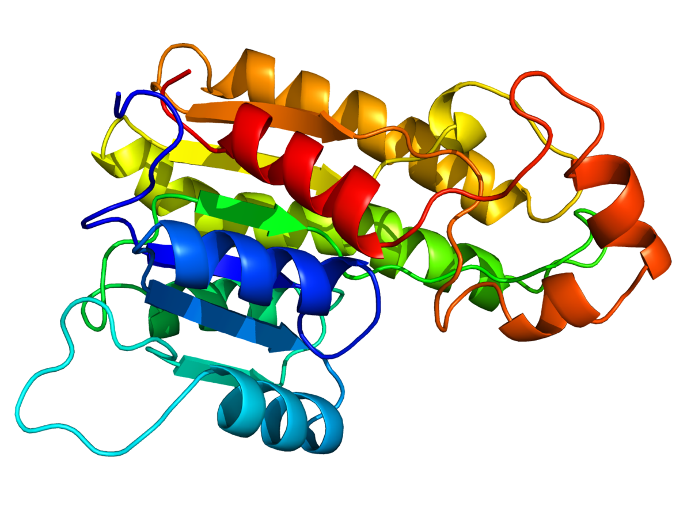

# Mini-project

## Introduction
In recent years, the field of machine learning has been increasingly applied to the analysis and understanding of 3D structures of large biomolecules. This emerging area holds great promise for advancing our knowledge in fields such as biochemistry, structural biology, and drug discovery (such as finding a COVID vaccin). Despite the growing interest, there is still a lack of a comprehensive network architecture that effectively combines the geometric and relational aspects inherent in this domain.

To bridge this gap, the paper titled "Learning from Protein Structure with Geometric Vector Perceptrons" by Bowen Jing, Stephan Eismann, Patricia Suriana, Raphael J.L. Townshend, and Ron O. Dror from Stanford University introduces a novel approach that addresses the limitations of existing architectures. The authors propose the use of geometric vector perceptrons (GVP's), which extend the functionality of standard dense layers to operate on collections of Euclidean vectors. By integrating these layers into graph neural networks, the proposed approach enables simultaneous geometric and relational reasoning on efficient representations of macromolecules.

The main objective of this study is to demonstrate the effectiveness of GVP's in tackling two fundamental challenges in learning from protein structure: model quality assessment and computational protein design. Through comprehensive experiments and evaluations, the authors compare their approach with existing classes of architectures, including state-of-the-art convolutional neural networks and graph neural networks. The results showcase their state-of-the-art performance of their proposed method in both problem domains, highlighting its potential to advance the field of learning from protein structure.

In this review, we will provide an analysis of the key components of the paper, discussing its strengths, weaknesses, and potential implications. Additionally, we will present our group's response to the paper, highlighting our novel contribution and its relevance to the research presented. Finally, we will delve into the results obtained by our work, linking them to the code available in the accompanying Jupyter notebook. By the end of this blogpost, readers will gain a comprehensive understanding of the significance of the paper's findings and our contributions to the field.

Before proceeding further, it is essential to review related work in the area of learning from protein structure, setting the stage for the novel approach proposed by Jing et al.

### Related work

## Methods 

## Weaknesses/Strengths/Potential
The paper "Learning from Protein Structure with Geometric Vector Perceptrons" presents an innovative approach that addresses the limitations of existing network architectures for learning from protein structure as discussed in the introduction. While the proposed method introduces significant advancements, such as capturing geometric properties in GNNs, it is important to consider its strengths, weaknesses, and potential implications.

### Weaknesses
One of the primary weaknesses of the proposed method lies in the use of geometric vector perceptrons (GVP) as the primary building block for the network architecture. Although GVPs offer the advantage of operating on collections of Euclidean vectors, they may not fully capture the complexity and long-range dependencies present in protein structure data. This limitation could potentially hinder the model's ability to learn intricate spatial relationships within protein structures accurately.

Furthermore, the reliance on dense layers within the GVPs introduces computational inefficiencies, especially when dealing with large-scale datasets. The increased parameter count and computational complexity may pose challenges when deploying the model in real-world scenarios or when working with limited computational resources.

### Strengths
Despite the identified weaknesses, the proposed approach also exhibits several notable strengths. The integration of geometric and relational reasoning within the network architecture allows for a comprehensive understanding of the structural aspects of macromolecules. By leveraging GVPs and graph neural networks, the model can capture both local geometric features and global relational information, providing a more holistic representation of protein structure.

Moreover, the authors demonstrate the effectivenes of their approach by showcasing significant improvements over existing architectures, including state-of-the-art convolutional neural networks and graph neural networks. This performance enhancement is particularly evident in the two fundamental challenges addressed in the paper: model quality assessment and computational protein design. The superior results obtained by the proposed method underscore its potential as a powerful tool for advancing the field of learning from protein structure.

### Potential
The paper's proposed approach opens up several exciting possibilities for future research and applications. One potential avenue for improvement is the replacement of GVPconv with a transformerConv. Transformers have shown remarkable success in various natural language processing tasks and have the potential to capture long-range dependencies effectively. By incorporating a transformerConv module into the network architecture, it is possible to enhance the model's ability to capture global relationships and improve its performance on complex protein structure data.

Additionally, the authors' idea of replacing the linear layers within the transformerConv with GVPs introduces a novel combination of architectural components. This, approach has the potential to exploit the strengths of both GVPs and transformers, leveraging the geometric reasoning capabilities of GVPs while benefiting from the attention mechanisms and parallelizability of transformers. Further exploration and experimentation with this hybrid architecture could yield even more robust and efficient models for learning from protein structure.

## Novel Contribution
Description of Novel contributions of our work.

## Results
Results of our work with link to the code in Jupyter Notebook.
Every task has been trained on three seeds (0,34,42) on n epochs with the default params** (see appendix)   
| **Task** | **Metric** | **GVPGNN** | **GVPTransformer** |
|----------|------------|------------|--------------------|
| **SMP**  |            |            |                    |
| **LBA**  |            |            |                    |
| **LEP**  |            |            |                    |
| **MSP**  |            |            |                    |
| **RES**  |            |            |                    |

| **Task** | **Metric** | **GVPTransformer** | **GVPTransformer + ProteinBERT** |
|----------|------------|--------------------|----------------------------------|
| **RES**  |            |                    |                                  |

## Conclusion
Conclusion of our work.

## Individual Student's Contribution
Description of what each student's contribution to the project was.

## References

## Appendix

